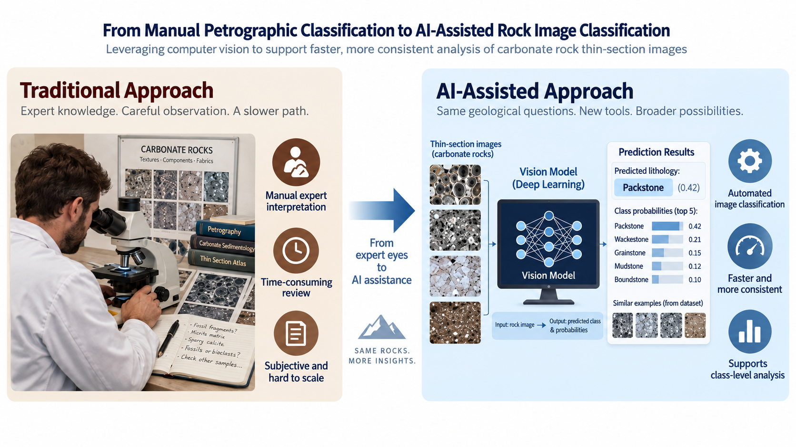

# Deep Carbonate Classification Project 
The DeepCarbonate dataset is a large petrographic image dataset designed for deep-learning-based lithology classification. It contains images from 22 lithological classes captured under three optical modes: plane-polarized light (PPL), cross-polarized light (XPL), and reflected light (R). The data are organized into predefined training, validation, and test sets, making the dataset suitable for reproducible computer-vision experiments. [View the Zenodo Record](https://zenodo.org/records/18061204)


## Project Motivation

Understanding reservoir rock properties is fundamental to reservoir characterization and development. Petrographic thin-section analysis provides detailed information about **lithology, mineral composition, texture, pore structure, depositional features, and diagenetic alteration**—all of which can influence porosity, permeability, fluid flow, and ultimately reservoir performance.

In carbonate reservoirs, this interpretation can be particularly challenging because strong heterogeneity and complex diagenetic processes can produce significant variation in rock properties over short distances. Accurate lithological and petrographic classification therefore contributes to improved **rock typing, reservoir zonation, geological modeling, and understanding of flow behavior**, supporting better-informed reservoir development and production decisions.

Traditionally, thin-section interpretation relies heavily on expert visual inspection and can be time-consuming, subjective, and difficult to scale across large image collections. This project explores whether modern computer-vision models can assist with automated carbonate rock classification while addressing practical challenges such as **class imbalance, visually similar lithologies, and ambiguous or noisy labels**.

The broader motivation is to investigate how deep learning can complement geological expertise and contribute to more scalable, consistent, and data-driven reservoir characterization workflows.


## Executive Summary
<p align="center">
  <br>
  <i>Figure 1: A computer vision model. Aim is to replace the traditional approach with computer model</i>
</p>

This project investigates the use of deep learning for automated classification of carbonate rock images using the **DeepCarbonate** dataset. The objective was to build an end-to-end computer-vision workflow capable of distinguishing multiple lithological classes while addressing practical challenges such as **severe class imbalance, visually similar rock types, and potential label ambiguity**.

Several transfer-learning approaches were evaluated, with experiments focused on model architecture, data augmentation, weighted sampling, focal loss, and class-level performance analysis. Confusion matrices and per-class metrics were used to identify classes that were consistently difficult to distinguish, leading to additional investigation of the dataset structure and selected class consolidation.

The final model achieved a **test accuracy of 38.55%**, with a **macro F1 score of 0.301**, **macro precision of 0.307**, and **macro recall of 0.349**. Although overall classification performance remains limited, the results highlight the significant impact of dataset quality, class overlap, and imbalance on multi-class geological image classification.

Beyond model performance, the project demonstrates a complete machine-learning workflow including **data exploration, preprocessing, transfer learning, experiment tracking, imbalance mitigation, model evaluation, error analysis, and deployment**. The project therefore serves both as an investigation into automated petrographic classification and as a practical study of the challenges involved in developing deep-learning systems using real-world geological data.

## What Business Problem Is Being Solved?

Petrographic thin-section interpretation is an important part of reservoir characterization, but it is traditionally **manual, time-consuming, and dependent on specialized geological expertise**. When large numbers of samples need to be reviewed, this can become a bottleneck in subsurface evaluation and can introduce variability between interpreters.

The business problem is therefore one of **speed, scalability, and consistency**. A computer-vision system capable of classifying carbonate rock images could assist geologists by rapidly screening large image collections, providing consistent preliminary classifications, and highlighting uncertain samples that require expert review.

Such a system is not intended to replace geological interpretation, but to support it by reducing repetitive manual work and allowing specialists to focus on more complex cases. In an operational setting, this could help shorten interpretation workflows, improve standardization across datasets, and accelerate the availability of geological information used in **reservoir characterization, rock typing, geological modeling, and development planning**.

The broader business value is faster access to subsurface insights that can support more informed reservoir-development and production decisions.

## Summary of the 22-Class Results

The original 22-class model achieved reasonable validation performance but generalized poorly to the test set.

| Metric              | Test Result |
| :------------------ | :---------- |
| **Accuracy**        | 0.2817      |
| **Macro F1**        | 0.2346      |
| **Macro Precision** | 0.2578      |
| **Macro Recall**    | 0.2571      |

The confusion matrix and class-wise F1 analysis showed that several classes were repeatedly confused, particularly **Classes 2 and 13**, **18 and 19**, and **21 and 22**. These errors persisted even for some well-represented classes, suggesting that class imbalance alone did not explain the poor performance.

Instead, the results pointed to broader issues involving class overlap, ambiguous class boundaries, and possible labeling inconsistencies. The 22-class results therefore motivated the later dataset restructuring and the subsequent 18-class experiments.

## Summary of the 18-Class Results

After removing the inconsistent Class 1 and merging the most frequently confused class pairs, the restructured 18-class model showed improved overall performance compared with the original 22-class formulation.

| Metric              | Test Result |
| :------------------ | :---------- |
| **Accuracy**        | 0.3855      |
| **Macro F1**        | 0.3007      |
| **Macro Precision** | 0.3069      |
| **Macro Recall**    | 0.3488      |

The 18-class model achieved higher test accuracy, macro F1, precision, and recall than the original 22-class model. This suggests that simplifying the label space and removing ambiguous class boundaries made the classification problem more learnable.

However, the model still showed a substantial drop from training and validation performance to the test set, and the confusion matrix continued to show errors across several classes. This indicates that restructuring improved the problem but did not eliminate the underlying issues of class overlap, within-class variability, and limited generalization.

Overall, the 18-class experiment supported the conclusion that dataset structure was an important factor in model performance, while also showing that further improvements would likely require better class definitions, cleaner labels, or higher-quality data.

## Deployment Decision

## Modules
### Data
* **carbonate_1223**: The 22 class data should be downloaded and put in here. The is what is used in notebook 0 & 2
* **carbonate_1223 _merge**: The 22 class data should be downloaded and put in here. The is what is used in notebook 0 & 3
### Docs
Explainations of model results
### Models
saved models, .pth files
### Modular
Helper .py functions to run notebooks
### Pictures
Pictures used to make readme files
### wandb
wandb files
### duplicate_report.csv
Summary of  duplicate images that was removed

### Notebook
* **00_Download_and_make_data.ipynb** : Gives instruction how to download data and delete duplicate images in all folders
* **01_Development_workbook.ipynb**: Used for development of all functions and classes. Really not needed.
* **02_Modular_workbook_all.ipynb**: Original 22 classes.
* **03_Modular_workbook_merged.ipynb**:18 classes workbook.
* **04_wandb.ipynb**: Experiment tracking/export code.Experiment tracking/export code.

## Project
```text
Rock_Classification/
├── 00_Download_and_make_data.ipynb
├── 01_Development_workbook.ipynb
├── 02_Modular_workbook_all.ipynb
├── 03_Modular_workbook_merged.ipynb
├── 04_wandb.ipynb
├── convnext_4strategy_optuna.db
├── convnext_strategy2_adamw_optuna.db
├── convnext_tiny_20percent_optuna.db
├── docs
│   ├── 01_problem_and_dataset.md
│   ├── 02_Models&Experimentation.md
│   └── 03_Final_data restructuring_and_Results.mdntitled.txt
├── duplicate_report.csv
├── environment.yml
├── models
│   ├── FULL_MERGED_18_classes_convnext_tiny_adamw_trial21_epoch11.pth
│   ├── FULL_V2_convnext_tiny_weighted_focal_trial9_5epochs.pth
│   ├── INFERENCE_MERGED__18_class_convnext_tiny_reproduce_adamw_trial21_epoch11.pth
│   └── INFERENCE_V2_convnext_tiny_weighted_focal_trial9_5epochs.pth
├── modular
│   ├── data_setup.py
│   ├── engine.py
│   ├── model_builder.py
│   ├── train_test.py
│   ├── utility.py
│   └── visualization.py
├── pictures
├── project.csv
├── Readme.md
└── requirements.txt
```

## Technologies

### Programming and Development
* **Python 3.12** — Main programming language used for image preprocessing, dataset construction, deep-learning model development, evaluation, and experiment analysis.
* **JupyterLab** — Interactive environment used for exploratory data analysis, model experimentation, visualization, and project documentation.
* **Git and GitHub** — Version control, source-code management, and project documentation.

### Data Preparation and Image Processing
* **Pandas** — Organizing experiment results, class-distribution summaries, and model-performance data.
* **NumPy** — Numerical operations, array manipulation, and supporting image and metric calculations.
* **Pillow (PIL)** — Loading and preprocessing petrographic thin-section images.
* **Torchvision** — Image transformations, augmentation, preprocessing, and access to pretrained computer-vision architectures.

### Deep Learning and Computer Vision
* **PyTorch** — Core deep-learning framework used to build, train, fine-tune, and evaluate image-classification models.
* **Torchvision Models** — Pretrained convolutional architectures used for transfer learning, including ConvNeXt-Tiny and EfficientNet-B0.
* **DINOv2** — Pretrained vision-transformer representation model evaluated as an alternative transfer-learning approach.
* **Transfer Learning** — ImageNet-pretrained models were adapted to carbonate-rock classification to improve performance and reduce the amount of task-specific training required.

### Class Imbalance and Training Strategies
* **Weighted Cross-Entropy Loss** — Used to increase the contribution of underrepresented lithology classes during training.
* **Focal Loss** — Evaluated as an alternative loss function for reducing the influence of easily classified samples and emphasizing more difficult examples.
* **WeightedRandomSampler** — Used to oversample minority classes during mini-batch construction.
* **Data Augmentation** — Random flipping and controlled brightness, contrast, saturation, and hue transformations were used to improve training diversity and model robustness.

### Model Evaluation
* **TorchMetrics** — Calculation of multiclass accuracy, precision, recall, weighted F1-score, and macro F1-score.
* **Scikit-learn** — Supporting model evaluation, class analysis, and confusion-matrix-related utilities.
* **Confusion Matrices** — Used extensively to identify systematic misclassification and overlap between petrographic classes.
* **Class-wise F1 and Recall Analysis** — Used to evaluate performance beyond overall accuracy, particularly for strongly imbalanced classes.

### Hyperparameter Optimization and Experiment Tracking
* **Optuna** — Automated hyperparameter optimization for parameters such as learning rate, focal-loss gamma, and other model-training settings.
* **Weights & Biases (W&B)** — Experiment tracking, metric logging, confusion-matrix visualization, class-level performance analysis, and comparison of training strategies.

### Visualization
* **Matplotlib** — Visualization of class distributions, training curves, validation performance, confusion matrices, and model-comparison results.
* **Seaborn** — Statistical visualization and exploratory analysis of dataset and model-performance patterns.

### Environment and Reproducibility
* **Conda / Mamba** — Python environment and dependency management.
* **`requirements.txt`** — Project-level Python dependency specification.
* **`environment.yml`** — Reproducible Conda environment configuration for recreating the development environment.

## Installation
### 1. Clone the Repository
git clone https://github.com/adebam/Rock_Classification.git <br>
cd Rock_Classification
### 2. Install Dependencies
mamba env create -f environment.yml
### 3. Activate the Environment
conda activate rock-classification <br>
or using Mamba <br>
mamba activate rock-classification
### 4. Start JupyterLab
jupyter 


## License
Copyright (c) 2026 Dayo Adebamiro

Permission is granted to use, copy, modify, and distribute this software for personal, educational, and research purposes only.

The above copyright notice and this permission notice shall be included in all copies or substantial portions of the Software.

THE SOFTWARE IS PROVIDED "AS IS", WITHOUT WARRANTY OF ANY KIND, EXPRESS OR IMPLIED, INCLUDING BUT NOT LIMITED TO THE WARRANTIES OF MERCHANTABILITY, FITNESS FOR A PARTICULAR PURPOSE AND NONINFRINGEMENT. IN NO EVENT SHALL THE AUTHORS OR COPYRIGHT HOLDERS BE LIABLE FOR ANY CLAIM, DAMAGES OR OTHER LIABILITY, WHETHER IN AN ACTION OF CONTRACT, TORT OR OTHERWISE, ARISING FROM, OUT OF OR IN CONNECTION WITH THE SOFTWARE OR THE USE OR OTHER DEALINGS IN THE SOFTWARE.