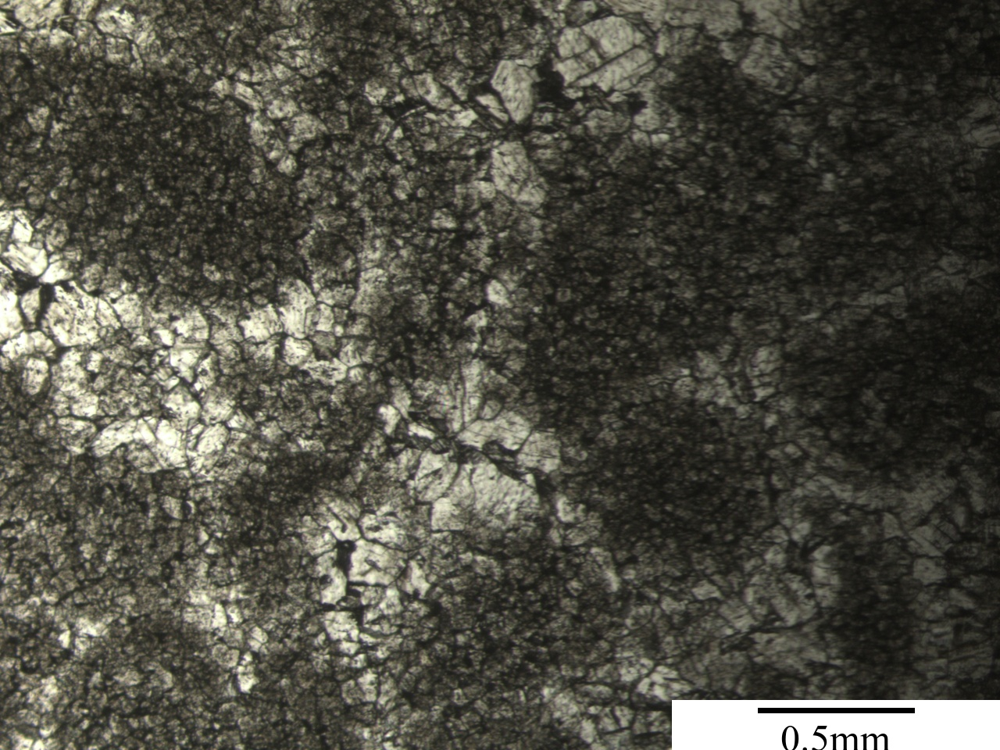
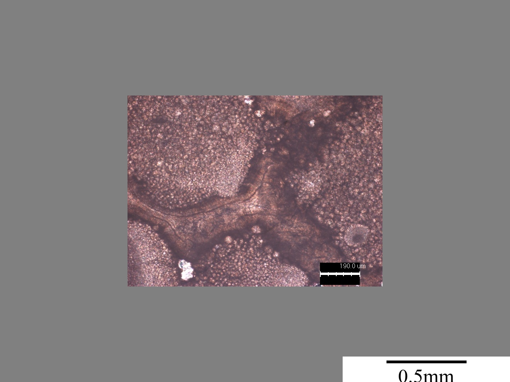
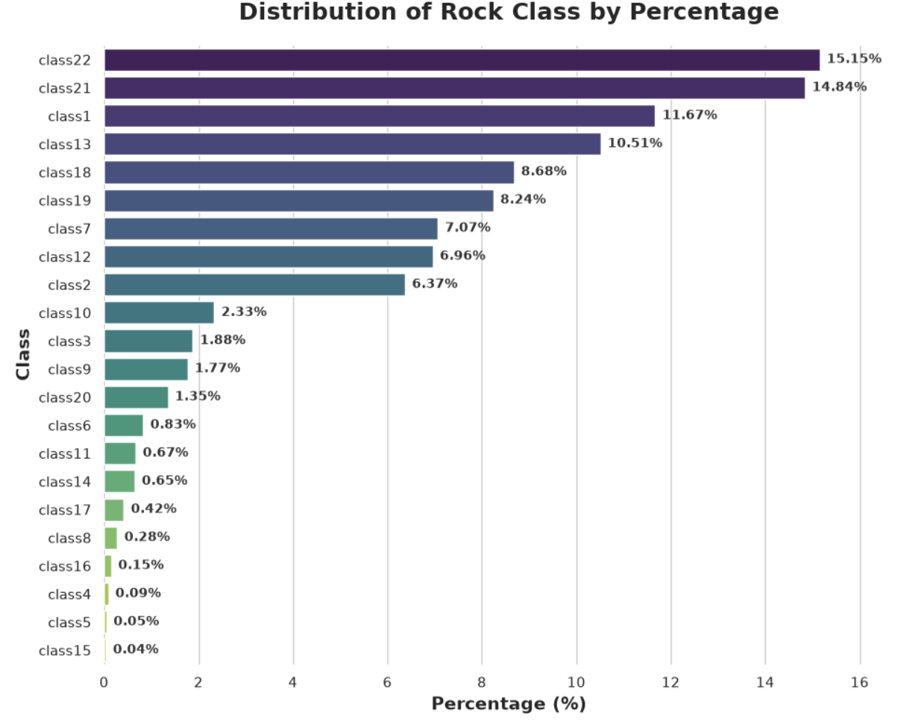
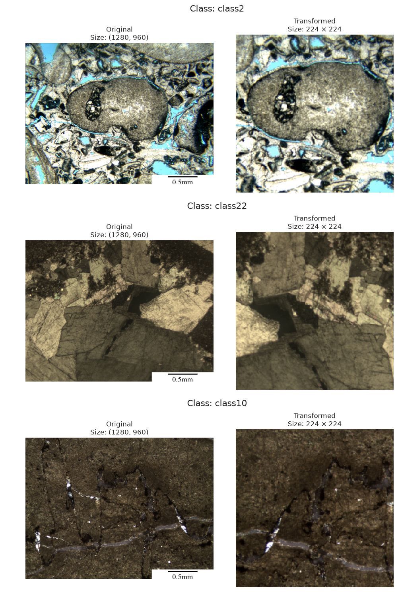

## Dataset Exploration

## What DeepCarbonate Contains

**DeepCarbonate** is a large petrographic image dataset developed for deep-learning-based carbonate rock classification. The dataset is approximately **33.2 GB** and is organized to support standardized training and evaluation of computer-vision models. The total number of images is 

The images are grouped according to three optical imaging modes:

* **Plane-Polarized Light (PPL)** – thin-section images observed using plane-polarized light.
* **Cross-Polarized Light (XPL)** – thin-section images captured under crossed polarizers, which reveal additional mineralogical and textural characteristics.
* **Reflected Light (R)** – images acquired using reflected-light microscopy.

Within each optical mode, the images are separated into predefined **training, validation, and test datasets**. Each split contains folders representing **22 lithological classes**, labeled `class1` through `class22`.

Individual image filenames also preserve information about their petrographic classification. For example, filenames follow patterns such as `Arenaceous.1.jpg` or `Bioclastic.25.jpg`, allowing the associated lithology to be identified directly from the image name.

The dataset therefore has the following general structure:

```text
DeepCarbonate
│
├── PPL
│   ├── train
│   ├── val
│   └── test
│
├── XPL
│   ├── train
│   ├── val
│   └── test
│
└── R
    ├── train
    ├── val
    └── test
```

For my analysis only the PPL data was used.

## Dataset Challenges.
### Exact Duplicate Images
The first check was to determine if there were any image duplicates across the dataset. If identical images appear in both the training and evaluation sets, the model's performance may appear artificially high because it has already seen those images during training. 

The total number of images before deletion was **35,835**. A total of **10,147** duplicate images were identified and removed to reduce data leakage between classes and dataset splits. 

After deleting the duplicate images, the data distribution is as follows:

| Split | Image Count |
| :--- | :--- |
| **Train** | 15,999 |
| **Validation** | 6,686 |
| **Test** | 3,003 |
| **Total** | **25,688** |

However, removing duplicates does not resolve uncertainty in the class labels. If identical images appear under different class names, we cannot determine which label is correct from duplication alone. Deleting one copy may therefore remove the correctly labelled image while retaining an incorrectly labelled one.

### Class Labelling Error
For class 1, the name of the images are Vug in the train dataset, but in the val and test is it name Arenaceous. 
For class 22, the name of the images are also named Vug in the train dataset, and in the val and test is it name vug too.  
Visual inspection show that the images in class1/train look different than class1/val.

<div align="center">
  <table>
    <tr>
      <td align="center">
        
        <br>
        <b>Class 1: Train</b>
      </td>
      <td align="center">
        
        <br>
        <b>Class 1: Validation</b>
      </td>
    </tr>
  </table>
  <p><i>Figure 2: Visual Comparison. Class1/train and Class1/val</i></p>
</div>

### Visual Inspection
A manual review of the dataset showed that images assigned to **Class 1, Class 21, and Class 22** often appear visually similar. In several cases, the differences between these classes were difficult to distinguish based on visual inspection alone.

This raised concerns about possible **class overlap, ambiguous labeling, or inconsistent class boundaries** within the dataset. Such overlap can make the classification task more difficult because the model may be asked to learn distinctions that are not visually well separated.

### Class Imbalance
The class distribution is highly imbalanced. A small number of classes dominate the dataset, with Classes 22, 21, 1, and 13 accounting for a large share of the images, while several classes each represent less than 1% of the data. If not tackled properly, this imbalance can bias the model toward majority classes and reduce performance on rare lithologies.

<p align="center">
  <br>
  <i>Figure 3: Class Distribution</i>
</p>

## Key Findings from Dataset Exploration

Dataset exploration revealed several issues that could significantly affect model performance. Exact duplicates created a risk of data leakage, the class distribution was strongly imbalanced, and inconsistencies were observed in the labeling and visual characteristics of several classes. In particular, Classes 1, 21, and 22 showed substantial visual overlap, while Class 1 also exhibited different apparent class definitions between the training and evaluation datasets.

These findings suggest that dataset quality and class definition may be as important as model architecture in determining classification performance. The initial modeling experiments therefore retain the available class structure while using class-level metrics and confusion matrices to determine how these dataset characteristics affect model behavior.


## Preprocessing

Before training the deep-learning models, the petrographic images were preprocessed to create a consistent and reliable input pipeline. The objective of preprocessing was to reduce irrelevant variation in the images, standardize their dimensions and intensity distributions, and prepare them for transfer learning with pretrained convolutional neural networks.

The preprocessing workflow included the removal of non-petrographic image regions, resizing and cropping of the images to the required model input dimensions, conversion to tensors, and normalization using the statistics associated with the pretrained model weights. These steps ensured that the input images were compatible with the architectures used during model development.

Data augmentation was also applied to the training dataset to introduce controlled variations in image orientation and appearance. Transformations such as horizontal flipping and moderate changes in brightness, contrast, saturation, and hue were used to improve the model's ability to generalize to variations in petrographic imaging conditions. Augmentation was applied only to the training data, while the validation and test datasets were processed using deterministic transformations to provide consistent and reproducible model evaluation.

The preprocessing pipeline was kept consistent across experiments wherever possible so that differences in model performance could primarily be attributed to changes in model architecture, loss functions, sampling strategies, or other experimental configurations rather than changes in the input data pipeline.

The table below summarizes the main functions used in the image transformation pipeline.

| Function | Purpose |
| :--- | :--- |
| `remove_bottom_annotation()` | Crops the bottom of the image to remove the scale bar and annotations. |
| `Resize()` | Resizes images to the dimensions required by the preprocessing pipeline. |
| `RandomCrop()` | Randomly selects a fixed-size image region during training, introducing variation in the features shown. |
| `CenterCrop()` | Selects the central image region for consistent validation and test inputs. |
| `RandomHorizontalFlip()` | Randomly flips training images horizontally to introduce orientation variation. |
| `RandomVerticalFlip()` | Randomly flips training images vertically when enabled; disabled by default in your pretrained pipeline. |
| `ColorJitter()` | Randomly adjusts brightness, contrast, saturation, and hue to simulate imaging variations. |
| `ToTensor()` | Converts images into PyTorch tensors and scales standard image pixel values from 0–255 to 0–1. |
| `Normalize()` | Standardizes each color channel using a specified mean and standard deviation. For pretrained models, the pipeline uses the normalization statistics associated with the pretrained model weights. |
| `Compose()` | Combines the transformations into a pipeline applied in the specified order. |

All of the steps above were consolidated into a single function called `create_transformation()`, which builds separate image-processing pipelines for training and evaluation. Both pipelines remove bottom annotations, resize and crop the images, convert them to tensors, and normalize pixel values using either statistics calculated from the training data or normalization statistics associated with pretrained model weights.

The training pipeline additionally applies random cropping, optional flips, and color adjustments, while the validation and test pipelines use a fixed center crop to ensure consistent evaluation. The function returns both transformation pipelines, the normalization mean and standard deviation, and the training dataset size.

<p align="center">
  <br>
  <i>Figure 4: Transformation results examples of the training pipeline</i>
</p>

## DataLoaders
Datasets and DataLoaders for experiments was created using 5%, 20%, and 100% of the training data. The full validation dataset was used for the validation for all the different experiments. 

The **5%** and **20%** training subsets were created using `make_stratified_subset()`. This function uses stratified random sampling to select images while approximately preserving the original class proportions. The `fraction` parameter determines how much data is selected, and a fixed random seed of `42` makes the selection reproducible. It returns a PyTorch `Subset` that references the selected images without copying or modifying the original files.

The **100%** training dataset uses the full dataset loaded by `RockClassificationDataset()`, so no subset sampling is required. 

Utilizing these different sizes allows initial experiments to run quickly on smaller subsets before testing promising configurations on the full dataset. 

> **Note:** Stratification preserves the existing class imbalance, meaning very rare classes may have few or no examples in the 5% subset.


Each training subset receives its own transformations, while validation and test images use consistent evaluation transformations. Images are loaded in batches of 32, using four worker processes. Training images are shuffled, while validation and test images retain their order. The validation set remains the same size for all experiments.


