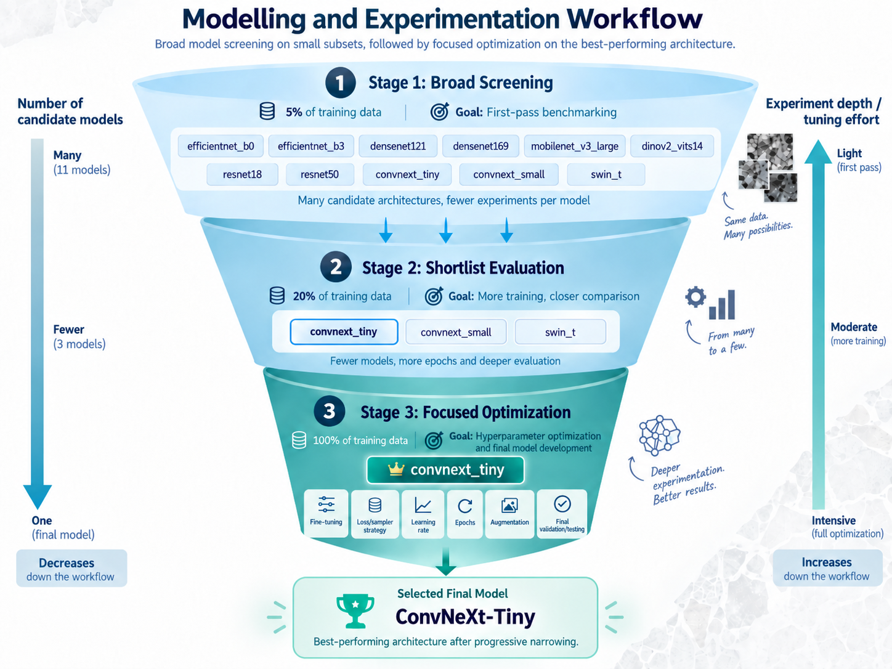
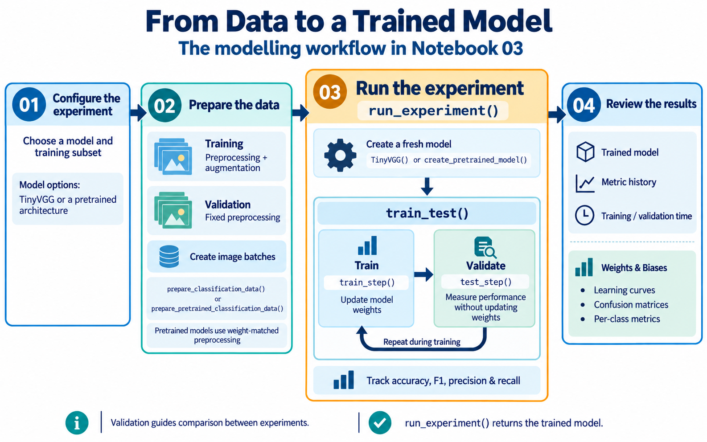
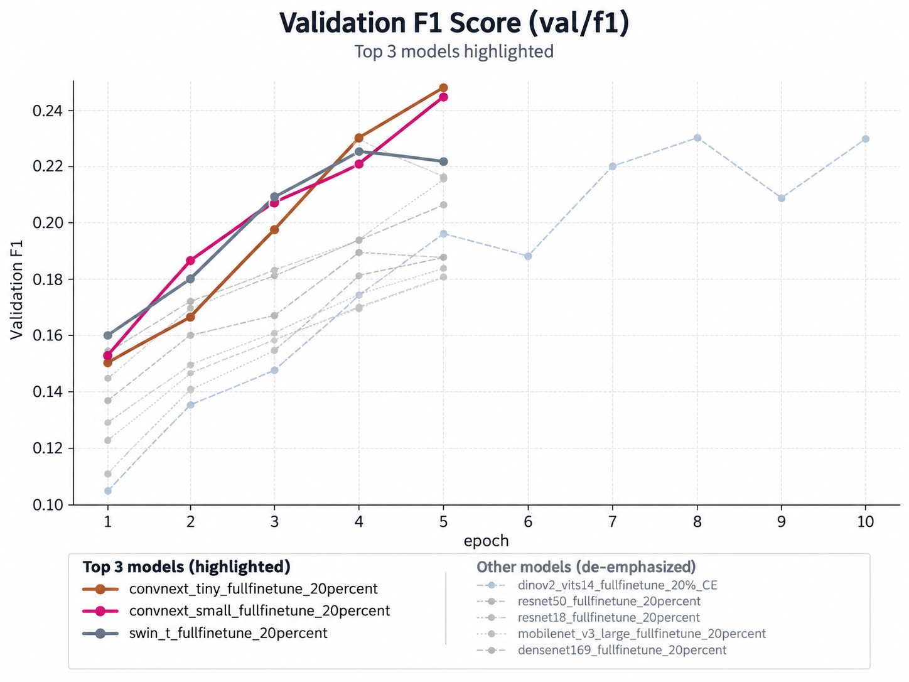
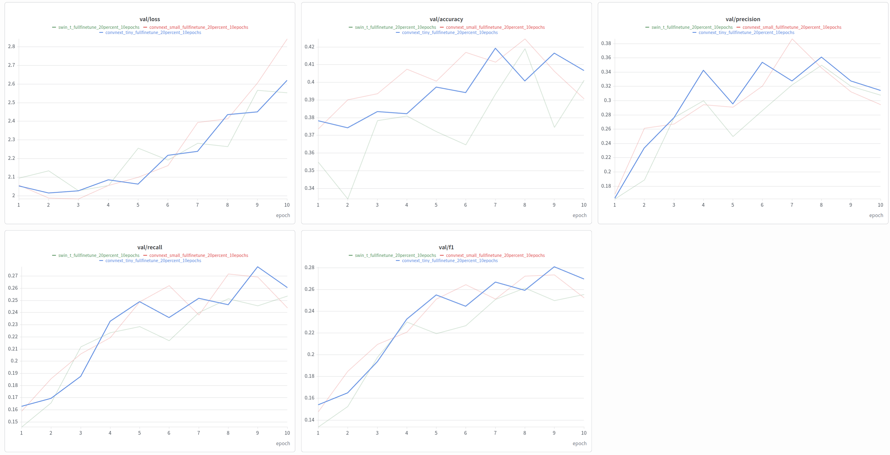
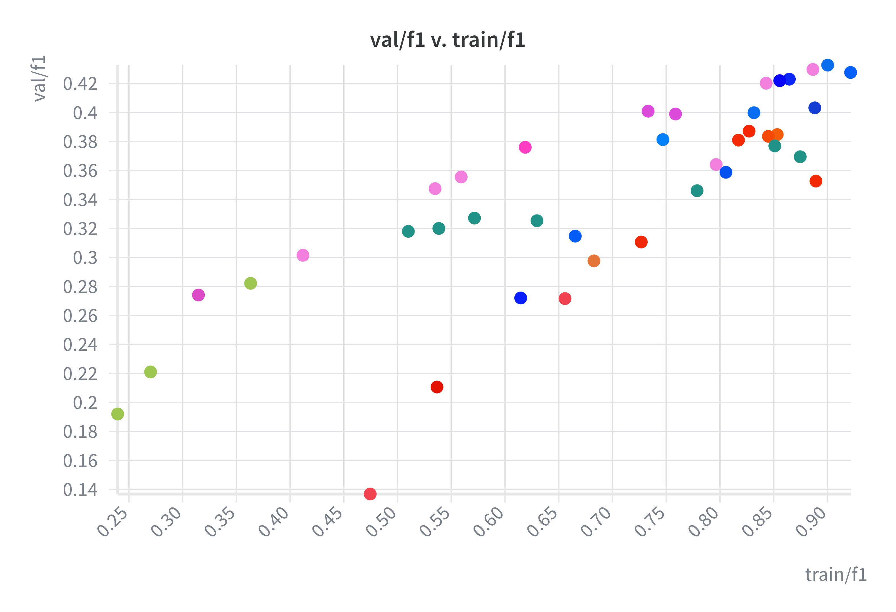
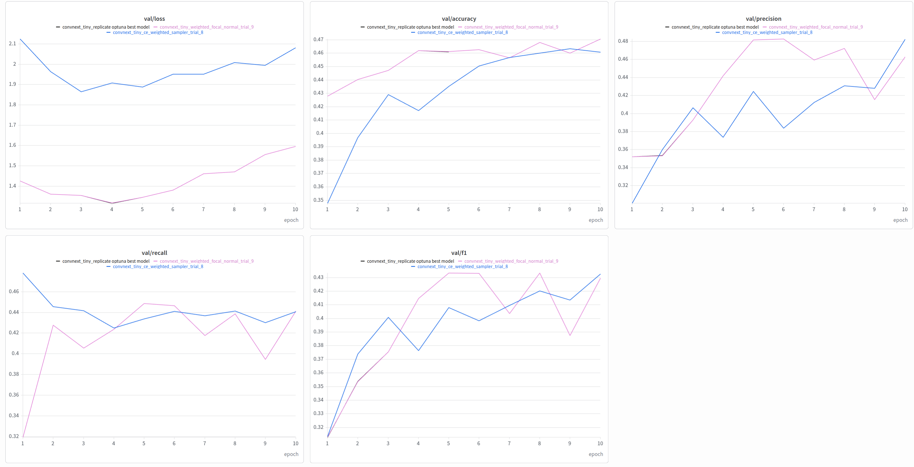
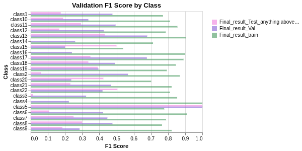
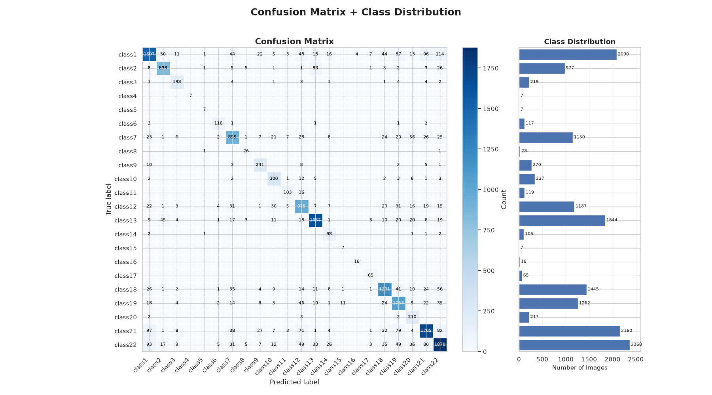
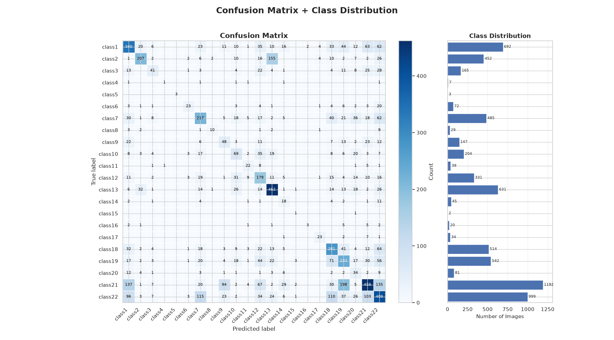

# Models
## Overall Summary

   
  <i>Figure 1: Experimentation Philosophy</i>

The modelling and experimentation workflow follows a progressive narrowing strategy. A broad set of candidate deep-learning architectures is first screened using 5% of the training data to quickly identify the most promising models while minimizing computational cost. The strongest candidates are then evaluated more thoroughly using 20% of the training data and longer training runs. Based on these results, ConvNeXt-Tiny is selected as the leading architecture. The final stage uses 100% of the training dataset and focuses on deeper experimentation and hyperparameter optimization, including learning rate, loss function, sampling strategy, augmentation, and training duration. As the workflow progresses, the number of candidate models decreases while the depth and number of experiments performed on the selected architecture increase.

## Model Families Considered

The initial model screening included architectures from several major deep-learning families. Models within the same family share similar architectural characteristics, so they can be discussed together while noting differences in model size and capacity.

| Model Family | Models Evaluated | Main Advantages | Main Disadvantages |
| :--- | :--- | :--- | :--- |
| **EfficientNet** | `efficientnet_b0`, `efficientnet_b3` | Strong accuracy-to-computation ratio; relatively parameter-efficient; well suited to transfer learning; compound scaling balances network depth, width, and input resolution. | Can be sensitive to training configuration; larger variants require more memory and computation; may offer limited gains when the dataset differs substantially from ImageNet. |
| **DenseNet** | `densenet121`, `densenet169` | Dense connections encourage feature reuse and improve gradient flow; can capture fine image textures effectively; often performs well when training data are limited. | Dense feature concatenation can increase memory usage; slower inference than simpler CNNs; deeper versions increase computational cost. |
| **ResNet** | `resnet18`, `resnet50` | Simple, stable, and extensively validated architecture; residual connections allow deeper networks to train effectively; strong baseline for transfer learning. | Older architecture compared with ConvNeXt and transformer-based models; may provide lower accuracy than newer architectures on complex visual tasks. |
| **MobileNetV3** | `mobilenet_v3_large` | Lightweight and computationally efficient; fast training and inference; attractive for deployment on resource-constrained systems. | Reduced model capacity can limit performance on visually complex classification tasks; optimized more heavily for efficiency than maximum predictive accuracy. |
| **ConvNeXt** | `convnext_tiny`, `convnext_small` | Modern CNN architecture incorporating design ideas inspired by vision transformers; strong image-classification performance; retains the simplicity and inductive biases of convolutional networks. | More computationally expensive than lightweight CNNs; larger variants require greater GPU memory and longer training times. |
| **Swin Transformer** | `swin_t` | Uses hierarchical representations and local attention windows; captures both local texture and broader spatial relationships; strong performance on many computer-vision tasks. | More computationally complex than traditional CNNs; training and fine-tuning can be sensitive to hyperparameters; benefits may be reduced on smaller datasets. |
| **DINOv2 / ViT** | `dinov2_vits14` | Uses powerful self-supervised visual representations learned from a very large and diverse image corpus; can provide strong transferable features without task-specific pretraining. | Computationally expensive; transformer architectures have weaker built-in locality assumptions than CNNs; fine-tuning strategy can strongly affect performance, particularly when the target dataset differs from the pretraining domain. |

**EfficientNet**
EfficientNet models use compound scaling, in which network depth, width, and image resolution are scaled together rather than independently. `efficientnet_b0` is the smaller and more computationally efficient variant, while `efficientnet_b3` provides greater model capacity at the cost of increased memory and computation. Because both models follow the same underlying architecture, their behavior is expected to be broadly similar, with B3 primarily testing whether additional capacity improves classification performance.

**DenseNet**
DenseNet architectures connect each layer to multiple subsequent layers, allowing features learned early in the network to be reused throughout the model. This feature reuse can be useful for petrographic images, where small textural and mineralogical patterns may contribute to classification. `densenet169` is deeper than `densenet121` and therefore provides greater representational capacity, but also increases computational requirements.

**ResNet**
ResNet models use residual connections that allow information to bypass intermediate layers, making deep neural networks easier to optimize. `resnet18` provides a relatively lightweight baseline, while `resnet50` offers substantially greater depth and capacity. ResNet was included as a well-established benchmark against which newer CNN and transformer architectures could be compared.

**MobileNet**
`mobilenet_v3_large` was included as a computationally efficient architecture. MobileNet uses techniques such as depthwise separable convolutions to reduce the number of parameters and computational operations. This makes it attractive for deployment, although the reduced model capacity can limit performance when distinguishing visually similar rock classes.

**ConvNeXt**
ConvNeXt represents a modern redesign of traditional convolutional neural networks. It incorporates several architectural concepts inspired by vision transformers while retaining convolution-based feature extraction. `convnext_tiny` and `convnext_small` therefore provide a useful comparison between two capacities within the same modern CNN family. ConvNeXt became particularly important during this project because the initial screening showed that it was one of the more promising architecture families, motivating increasingly focused experimentation in later stages.

**Swin Transformer**
Swin-T represents the transformer-based models evaluated during the initial screening. Unlike conventional CNNs, Swin Transformers use self-attention within local image windows and progressively build hierarchical image representations. This allows the model to capture both local petrographic textures and relationships between more distant image regions. Its increased architectural complexity, however, can make training and hyperparameter selection more demanding than conventional CNN approaches.

**DINOv2**
`dinov2_vits14` differs somewhat from the other models because DINOv2 is based on self-supervised pretraining rather than conventional supervised ImageNet classification. The backbone learns general-purpose visual representations from a large collection of unlabeled images and can then be adapted to downstream tasks such as rock classification. This made DINOv2 an interesting comparison with conventional pretrained CNNs. However, its transformer architecture is computationally more demanding, and its performance can depend strongly on whether the backbone is frozen or fine-tuned for the target dataset.

---

By screening multiple architectural families rather than only variations of a single network, the initial experiments compared different approaches to visual feature extraction, ranging from traditional residual CNNs and efficient lightweight networks to modern ConvNeXt architectures and transformer-based representations.

## Modelling Workflow 

   
  <i>Figure 2: Modelling Workflow  architecture</i>

The modelling workflow begins by selecting a model architecture and training subset, followed by preparing the images and organizing them into batches. Training images receive augmentation, while validation images use fixed preprocessing for consistent evaluation. The `run_experiment()` function creates a fresh model and repeatedly trains and validates it, recording performance metrics throughout the process. The trained model, metric history, and diagnostic plots are then used to compare experiments and identify areas for improvement.

### Functions for Model Construction
| Function or Class | Purpose |
| :--- | :--- |
| `TinyVGG()` | Builds a small convolutional neural network trained from scratch, providing a baseline for comparison with pretrained models. |
| `DINOv2Classifier()` | Loads a pretrained DINOv2 feature extractor and adds a classification layer for the rock categories. The feature extractor can optionally be frozen. |
| `torch.hub.load()` | Loads the DINOv2 architecture and pretrained weights from its source repository. |
| `get_pretrained_weights()` | Retrieves the default pretrained weights and associated preprocessing settings for the selected Torchvision model. Returns `None` for DINOv2, which loads its weights separately. |
| `create_pretrained_model()` | Creates the requested model, such as EfficientNet, ResNet, ConvNeXt, or Swin, and replaces its final classification layer to match the number of classes. |
| `model_summary()` / `torchinfo.summary()` | Displays model structure, input and output dimensions, parameter counts, and trainability. The custom wrapper obtains the required image size from the pretrained weights. |

> **Note:** In the current implementation, `create_pretrained_model()` applies the `freeze_backbone` option only to DINOv2. The custom `model_summary()` requires Torchvision weights and therefore does not support DINOv2.

### Functions for Data Preparation
| Function or Class | Purpose |
| :--- | :--- |
| `RockClassificationDataset()` | Loads image paths and folder-based class labels, then reads and transforms images when requested. |
| `Subset()` | Selects images using existing indices, allowing experiments to reuse the same training subset with different transformations. |
| `DataLoader()` | Supplies images and labels in batches, with options for shuffling, sampling, and parallel loading. |
| `prepare_classification_data()` | Prepares training and validation DataLoaders using configurable image sizes, augmentation, and normalization. Also displays transformed image examples. |
| `prepare_pretrained_classification_data()` | Performs the same preparation using the image size and normalization settings expected by the selected pretrained model. |
| `create_transformation()` | Builds training and evaluation transformations using configurable settings and either training-data or externally supplied normalization statistics. |
| `create_pretrained_transformation()` | Builds transformations using the pretrained weights’ preprocessing requirements, adding augmentation to the training pipeline. |
| `calculate_mean_std()` | Calculates the colour-channel statistics used for normalization when training-data statistics are selected. |
| `remove_bottom_annotation()` | Crops the bottom of each image to remove annotations and the scale bar. |
| `subset_with_transform()` | Gives a subset its own transformation settings while preserving its selected image indices. |
| `plot_transformed_images()` | Displays original and transformed images side by side to check preprocessing and augmentation. |

### Functions for Training and Imbalance Experiments
| Function or Class | Purpose |
| :--- | :--- |
| `run_experiment()` | Coordinates one experiment: creates a fresh model, loss function, and optimizer; runs training; records elapsed time; logs results to Weights & Biases; and returns the model and metrics. |
| `train_test()` | Runs the training and evaluation steps for the specified number of epochs, recording loss, accuracy, F1, precision, recall, and epoch duration. |
| `train_step()` | Processes one training epoch, calculates loss and metrics, and updates model parameters through backpropagation. |
| `test_step()` | Evaluates the model without updating its parameters and returns evaluation loss and metrics. |
| `nn.CrossEntropyLoss()` | Measures multiclass prediction error. Optional class weights give greater importance to errors on selected classes. |
| `FocalLoss()` | Reduces the contribution of easy examples so training focuses more on difficult predictions. Optional class weights also address imbalance. |
| `WeightedRandomSampler()` | Samples images according to assigned weights, increasing how often minority-class images appear during training. |
| `np.bincount()` | Counts examples in each class to calculate class weights and sampling probabilities. |
| `torch.optim.Adam()` / `torch.optim.SGD()` | Create optimizers that update model parameters. The experiment calls in this section primarily use Adam. |

### Functions Used to Log Experiment Results
| Function | Purpose |
| :--- | :--- |
| `log_confusion_matrix()` | Shows which classes the model predicts correctly and which it confuses. |
| `log_f1_by_class()` | Records the F1 score for each class. |
| `log_recall_by_class()` | Records how effectively the model identifies examples from each class. |
| `log_training_images_vs_f1()` | Compares class-level F1 with the number of examples encountered through the training DataLoader. |
| `log_confusion_matrix_with_distribution()` | Displays a confusion matrix alongside the evaluation dataset’s class distribution. |
| `wandb.init()`, `wandb.log()`, `wandb.finish()` | Start an experiment record, save configuration and results, and close the run. |

## Evaluation Metrics

Model performance was evaluated using multiple classification metrics rather than relying on accuracy alone. This was particularly important because the dataset contains substantial class imbalance, meaning that strong performance on common classes can mask poor performance on rare classes.

**Accuracy** measures the overall proportion of correctly classified images and provides a simple summary of model performance. However, it can be misleading when class frequencies are highly uneven.

**Precision** measures how often predictions for a given class are correct, while recall measures how many of the actual samples belonging to that class are successfully identified. These metrics help distinguish between models that overpredict certain classes and models that fail to detect them.

The **F1-score** combines precision and recall into a single metric. Both weighted F1 and macro F1 were used. Weighted F1 accounts for class frequency and therefore gives greater influence to common classes, whereas macro F1 gives equal importance to every class regardless of how many samples it contains. For this imbalanced multi-class problem, macro F1 is especially useful for assessing whether the model performs reasonably across both common and rare classes. In the work, it is the primary metric used for model validation choosing the best model in the optuna objective function. 

**Confusion matrices** and **class-level F1** and **recall scores** were also examined to identify specific classes that were frequently confused or consistently underperforming.

## Results 22 Classes Dataset
### Stage 1 Broad Screening using 20% of the dataset.
Several pretrained architectures were evaluated using 20% of the training dataset to identify the most promising model family. The models tested were:

* `efficientnet_b0`
* `efficientnet_b3`
* `densenet121`
* `densenet169`
* `mobilenet_v3_large`
* `resnet18`
* `resnet50`
* `convnext_tiny`
* `convnext_small`
* `swin_t`

Most models were trained for 5 epochs during this initial screening stage to allow relatively fast comparison while limiting computational cost.

The DINOv2 ViT-S/14 (`dinov2_vits14`) model was trained separately for 10 epochs because its validation loss improved more slowly than the other architectures. The longer training period provided additional time to assess whether its performance would continue to improve before comparing it with the other candidate models.

   
  <i>Figure 3: Initial Results. Screening for the best model using 20% of the dataset</i>

`convnext_tiny`, `convnext_small` and `swin_t` were the top performing models. These models performed better than the dinov2 which was trained for the 4 more epochs!

The three shortlisted architectures—**ConvNeXt-Tiny, ConvNeXt-Small—**, and **Swin-T** were trained for 10 epochs and compared using validation loss, accuracy, precision, recall, and **F1-score**.

**ConvNeXt-Tiny** showed the strongest overall validation performance. Its validation F1 increased from approximately **0.15** at the beginning of training to a peak of about **0.28**, which was higher than the peaks achieved by ConvNeXt-Small and Swin-T. It also finished the training period with the highest F1-score among the three models.

The same pattern is visible in recall. ConvNeXt-Tiny reached approximately **0.28** recall and remained above the other models toward the end of training. This was particularly important for the imbalanced dataset because higher recall indicates that the model was able to identify a larger proportion of samples belonging to the different classes rather than concentrating primarily on easier or more common classes.

For precision, **ConvNeXt-Small** briefly achieved the highest value around epoch 7, but this improvement was temporary and declined substantially afterward. ConvNeXt-Tiny showed a more balanced precision trajectory and finished with higher precision than the other two models.

The **accuracy** results tell a similar story. Although ConvNeXt-Small and Swin-T temporarily reached slightly higher accuracy at individual epochs, ConvNeXt-Tiny remained comparatively stable and finished training with the highest validation accuracy of the three models.

**Validation** loss provides a somewhat different picture. Swin-T had the lowest final validation loss, while ConvNeXt-Tiny had a lower loss than ConvNeXt-Small but not Swin-T. However, model selection was not based on validation loss alone. Because the classification problem contains substantial class imbalance, metrics such as F1-score, recall, precision, and accuracy provide additional information about classification performance that loss alone does not capture.

An additional observation is that validation loss increased during later epochs for all three models while classification metrics continued to improve or fluctuate. This may indicate increasing confidence in some incorrect predictions or the beginning of overfitting, and reinforces the importance of evaluating the models using multiple metrics rather than relying exclusively on cross-entropy loss.

   
  <i>Figure 4: Selecting between convNext, tiny, small and swin-T after 10 epochs</i>

**Overall interpretation**

ConvNeXt-Tiny was therefore selected not because it dominated every metric at every epoch, but because it demonstrated the strongest overall combination of F1-score, recall, precision, accuracy, and training stability. In particular, its superior F1 and recall performance made it the most promising architecture for further experimentation on this imbalanced multi-class classification problem.

### Stage 3 Focus Optimization on the full Dataset
#### Four Strategy Oputuna Implementation
After selecting ConvNeXt-Tiny, four training strategies were compared to determine how best to handle the dataset’s strong class imbalance. The strategies tested two possible interventions: changing how often images from each class are sampled, and changing how strongly different training errors affect the loss. 

All four strategies used the full training dataset, the same validation set, 10 training epochs, and a batch size of 32. Optuna ran 10 trials for each strategy, searching over the learning rate and weight decay. The best validation macro-F1 score across the 10 epochs was used to evaluate each trial. Macro-F1 was selected because it gives equal importance to every class, including rare classes.

#### Strategy 1: Normal sampling with ordinary cross-entropy
The first strategy used the original training distribution and ordinary cross-entropy loss. The model therefore saw the classes in their natural proportions, including the existing majority-class bias.
This served as a baseline. It measured how ConvNeXt-Tiny performed without using a sampler or a specialized loss function.

#### Strategy 2: Weighted Sampling with Ordinary Cross-Entropy

The second strategy used a `WeightedRandomSampler` with ordinary cross-entropy loss. Images from minority classes were assigned higher sampling probabilities, so they appeared more frequently during training.

The sampler used weights proportional to:

$$\frac{1}{\text{class frequency}}$$

Sampling was performed with replacement, meaning some minority-class images could appear multiple times in one training cycle. This strategy tested whether increasing the number of times minority classes were shown to the model was enough to improve performance.

#### Strategy 3: Normal Sampling with Weighted Focal Loss

The third strategy kept the original class distribution but replaced ordinary cross-entropy with weighted focal loss. Focal loss reduces the influence of examples that the model already classifies easily and focuses training on harder examples.

The loss also used class weights based on the inverse square root of class frequency:

$$\frac{1}{\sqrt{\text{class frequency}}}$$

This increased the contribution of rare classes while also emphasizing difficult predictions. The focal-loss parameter was fixed at $\gamma=2$.

#### Strategy 4: Weighted Sampling with Weighted Focal Loss

The fourth strategy combined both imbalance treatments. It used the weighted sampler to show minority classes more often and weighted focal loss to emphasize rare and difficult examples.

This was the most aggressive strategy because it changed both the training distribution and the loss calculation. It tested whether combining the two approaches would provide additional benefits, although it also risked overemphasizing minority classes.

#### Results of Optuna Optimization

   
  <i>Figure 5: Val F1/Train F1 to determine which strategy is the best</i>

The crossplot compares training F1-score with validation F1-score across the four imbalance-handling strategies. Points closer to the upper-right represent stronger performance on both the training and validation sets, while a large horizontal separation between training and validation performance can indicate poorer generalization.

**Strategy 1 — Normal sampling + cross-entropy (green)** provides the baseline. Its validation F1 generally increases as training F1 improves, but performance tends to level off below the strongest results from the other strategies. This suggests that leaving the original class imbalance untreated limits the model's ability to generalize across all classes.

**Strategy 2 — Weighted sampling + cross-entropy (blue)** produces some of the highest training F1-scores and also achieves strong validation performance. Several experiments fall near the upper-right corner of the plot, indicating that oversampling minority classes improves performance compared with the baseline. However, the relatively high training F1 compared with validation F1 also suggests a larger generalization gap in some runs.

**Strategy 3 — Normal sampling + weighted focal loss (pink)** shows the strongest overall validation performance. Several points reach validation F1 values above 0.40, including some with lower training F1 than Strategy 2. This suggests that weighted focal loss is helping the model focus on difficult and underrepresented examples without requiring aggressive resampling. The comparatively strong validation results also indicate good generalization.

**Strategy 4 — Weighted sampling + weighted focal loss (red)** is the most variable strategy. Although some configurations achieve competitive performance, others show much lower validation F1 despite relatively high training F1. This suggests that applying both weighted sampling and weighted focal loss may overcompensate for the class imbalance, causing minority classes to receive excessive emphasis and making training less stable.

Overall, the plot indicates that addressing class imbalance improves performance compared with the baseline, but more aggressive correction is not necessarily better. Weighted focal loss alone appears particularly effective, while combining weighted sampling with weighted focal loss introduces greater variability and a larger risk of poor generalization.

The results were ranked using the best validation macro-F1 score achieved by each strategy:

| Strategy Number | Strategy                                      | Best Trial | Best Validation Macro-F1 |
| :-------------- | :-------------------------------------------- | :--------- | :----------------------- |
| 3               | **Weighted focal loss with normal sampling**      | 9          | 0.4334                   |
| 2               | **Ordinary cross-entropy with weighted sampling** | 8          | 0.4327                   |
| 4               | Weighted focal loss with weighted sampling    | 9          | 0.4051                   |
| 1               | Ordinary cross-entropy with normal sampling   | 9          | 0.3898                   |

The two strongest approaches were weighted focal loss with normal sampling and ordinary cross-entropy with weighted sampling. This suggests that addressing class imbalance through either the loss function or the sampling process was helpful. Combining both methods did not improve the result in this experiment and produced a lower macro-F1 score, possibly because the minority classes were emphasized too strongly.

The experiment therefore showed that class imbalance should be treated as an experimental design choice rather than assuming that the most aggressive strategy will perform best.

#### Selection of the Best Model
The pink curve represents the selected Strategy 3 configuration using normal sampling with weighted focal loss. The black curve corresponds to the final selected model trained using the same configuration for 5 epochs, which is why it is largely hidden underneath the pink curve. The blue curve is the selected model from strategy 2.

The pink configuration was selected because it reached strong validation performance relatively early in training. By approximately epoch 5, the model achieved a validation F1-score of about 0.43, together with approximately 0.46 accuracy, 0.48 precision, and 0.45 recall. These results provided a strong balance across all classification metrics rather than optimizing a single metric in isolation.

The validation-loss curve also supported stopping the selected model after five epochs. Loss decreased during the early stages of training and reached its minimum around epochs 3–4 before beginning to increase. Although some classification metrics continued to fluctuate after epoch 5, there was no consistent improvement that justified additional training. In particular, later epochs showed greater variability in F1, precision, and recall while validation loss continued to rise.

Compared with the alternative trial shown in blue, the pink configuration also reached a high validation F1-score more quickly. The blue model eventually approached a similar F1-score after 10 epochs, but required approximately twice as many epochs to do so.

For these reasons, the 5-epoch version of the pink trial was selected as the final configuration. It provided strong validation performance while limiting unnecessary training and reducing the risk of further overfitting.

   
  <i>Figure 6: Selecting between the two best models and replicating the best one</i>

#### Performance on Test Data
Although the selected model achieved strong validation performance, its final test performance dropped to 28.2% accuracy and a macro F1-score of 0.235. The decline suggests limited generalization to the held-out test set. Class imbalance, visually overlapping lithologies, possible label noise, and differences between the validation and test distributions are likely contributors. These results highlight that dataset quality and class definition may be a larger limitation than model architecture alone
| Metric | Value |
| :--- | :--- |
| **Test Loss** | 2.9202 |
| **Test Accuracy** | 0.2817 |
| **Test Macro F1** | 0.2346 |
| **Test Precision** | 0.2578 |
| **Test Recall** | 0.2571 |

With 22 classes, a model guessing entirely at random would achieve an accuracy of only about 4.5% (1 out of 22). The model's achieved 28.17%, it is performing roughly six times better than random chance. This proves the model is extracting meaningful visual features from the rock images, but it accuracy is not good enough.

#### Insights from the Confusion Matrix and Class-wise F1 Scores
The confusion matrices and class-wise F1 scores provided important insight into the behavior of the classifier beyond the overall accuracy and macro F1 values. In particular, they revealed that several classes were consistently confused with one another, suggesting that some of the original class boundaries were not well separated in the image space.

   
  <i>Figure 7: F1 Score by Class</i>

   
  <i>Figure 8: Confusion Matrix for Validation, 22 classes</i>

   
  <i>Figure 9: Confusion Matrix for Test, 22 classes</i>

##### Motivation for merging selected classes
Based on the confusion matrices and class-wise F1 results, three class pairs were identified as candidates for merging:

* **Class 13** and **Class 2**
* **Class 21** and **Class 22**
* **Class 18** and **Class 19**

These pairs were selected because they showed **repeated bidirectional confusion**, meaning that samples from one class were frequently predicted as the other, and vice versa. This pattern appeared in both the training and validation confusion matrices, indicating that the issue was not a one-off result but a persistent classification difficulty.

For **Class 13 and Class 2**, the confusion matrix showed that these two classes were often mistaken for each other, while their class-wise F1 scores were weaker than those of better-separated classes. This suggests that the visual distinction between the two classes may be too subtle, inconsistent, or poorly represented in the dataset.

For **Class 21 and Class 22**, the same pattern was even more important. These two classes were heavily confused with one another despite having large numbers of training examples. Their mutual confusion suggests that the problem is not simply that the model saw too few examples, but that the classes themselves may overlap visually or may not be consistently labeled.

For **Class 18 and Class 19**, the confusion matrix again showed substantial off-diagonal counts in both directions. Their class-wise F1 scores also reflected this instability. This indicates that the model was struggling to learn a robust boundary between these two classes.

Merging these class pairs was therefore a practical attempt to reduce ambiguity in the label space. If two classes are consistently confused and are difficult to separate visually, combining them can create a more stable and meaningful classification problem.

##### Why class imbalance may not be the main issue
The experiments demonstrated that class imbalance affects model performance. Both **weighted focal loss with normal sampling and ordinary cross-entropy with weighted sampling performed** better than the baseline configuration of **ordinary cross-entropy with normal sampling**. This indicates that increasing the influence of minority classes—either through the loss function or through the sampling process—helped the model learn a more balanced representation of the dataset.

Although the dataset is clearly imbalanced, the confusion matrices suggest that **class imbalance is probably not the only or even the primary issue.**

If imbalance were the main problem, we would expect the poorest performance to occur mostly in the rarest classes, while the well-represented classes would be classified much more reliably. However, the confusion matrices show that this is not always the case. Some of the most problematic class pairs, such as **Class 21 and Class 22 and Class 18 and Class 19**, have relatively large class counts, yet they are still strongly confused.

This observation suggests that the model’s difficulty is not caused only by insufficient data for minority classes. Instead, it points to **class overlap, ambiguous visual boundaries, and possible label inconsistency** as more important limitations. In other words, the model may be seeing enough examples, but those examples may not define clearly separable categories.

The class-wise F1 plot supports this interpretation. Some classes with higher support still have only moderate F1-scores, while some low-frequency classes are poor not just because they are rare, but because they are hard to distinguish from neighboring classes. This indicates that the quality and separability of the labels may be a larger issue than imbalance alone.

##### Why performance degrades from train to validation to test

The class-wise F1 plot shows a clear overall pattern: training F1 is generally highest, validation F1 is lower, and test F1 is often the lowest. This degradation suggests that the model is learning patterns that work well on the training data but do not transfer equally well to unseen samples.

Several factors likely contribute to this drop:

* **Overfitting to the training set:** The model is able to learn training-specific patterns, which leads to higher class-wise F1 on the training data. However, these learned patterns do not generalize fully to the validation and test sets.
* **Class overlap and weak class boundaries:** The confusion matrices show that several classes are not clearly separable. When class boundaries are ambiguous, the model may perform reasonably on familiar training examples but struggle on unseen validation and test images.
* **Possible label noise or inconsistent labeling:** If visually similar samples are assigned to different classes, the model receives conflicting signals during training. This can artificially inflate training performance while reducing generalization performance on validation and test data.
* **Distribution differences between splits:** Even if the classes are the same, the train, validation, and test sets may differ in image quality, texture appearance, lighting, or sample composition. Such distribution shifts can further reduce performance on unseen data.

Taken together, the degradation from train → validation → test suggests that the challenge is not only model selection, but also the underlying dataset structure. The model is not simply underperforming because of a weak architecture; rather, the results indicate that some classes may be inherently difficult to separate with the current labeling scheme.