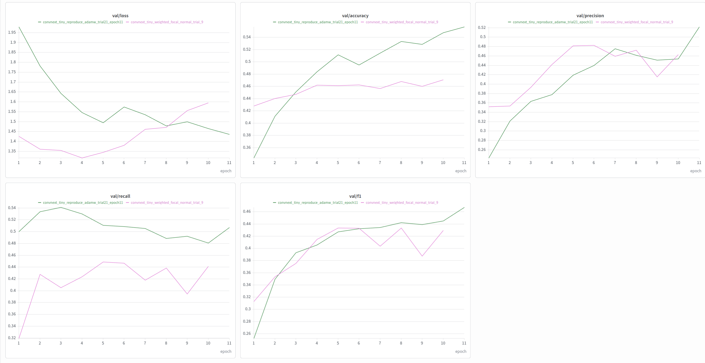
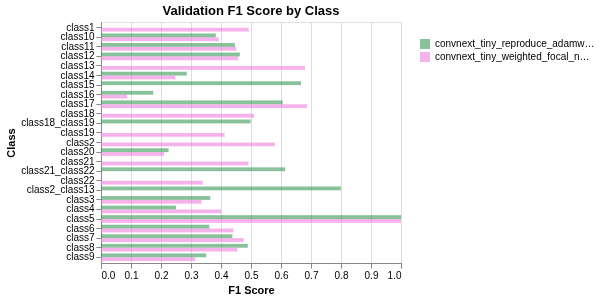
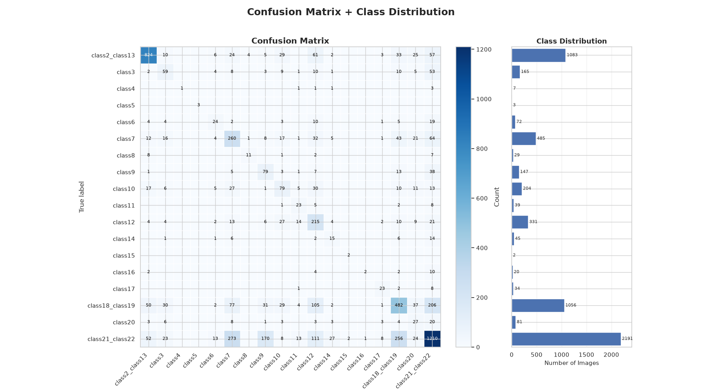
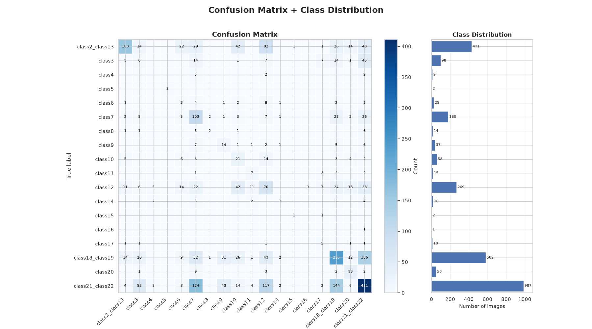

# Final Data Restructuring and Results
## Class Restructuring and Merging

The analysis in the previous section suggested that the primary limitation of the classification task may not lie in model architecture alone, but also in the structure and consistency of the dataset. Persistent confusion between specific class pairs indicated that some classes were not clearly separable visually, while the degradation in performance from training to validation and test suggested limited generalization.

Although class imbalance contributed to the problem, imbalance-aware strategies such as weighted focal loss with normal sampling and ordinary cross-entropy with weighted sampling improved performance without eliminating the recurring confusion between several well-represented classes. This suggested that class overlap and label definition were also important sources of error.

Based on the confusion-matrix analysis, class-wise F1 scores, and visual inspection of the images, the following classes were therefore merged:

| Original Classes | Restructured Class |
| :--- | :--- |
| **Class 2 + Class 13** | Merged class |
| **Class 18 + Class 19** | Merged class |
| **Class 21 + Class 22** | Merged class |

These merges reduce the original **22-class problem to 19 classes**.

An additional labeling inconsistency was identified for **Class 1** during the initial dataset exploration. Image filenames in the training split were associated with **Vug**, whereas images assigned to Class 1 in the validation and test splits were labeled **Arenaceous**. Visual inspection also showed a noticeable difference between the appearance of the Class 1 training images and those in the validation set. Because the same class identifier appeared to represent different petrographic categories across the dataset splits, Class 1 was removed rather than retained as a potentially inconsistent target.

After removing Class 1 and merging the three highly confused class pairs, the classification problem was reduced from **22 classes to 18 classes**.

The restructuring was applied consistently across the training, validation, and test directories while preserving the original dataset separately. The model was then retrained using the revised 18-class label structure so that performance could be evaluated under the simplified and more internally consistent classification scheme.

## Validation Performance Before and After Class Restructuring

   
  <i>Figure 1: Validation Results 18 classes vs 22 classes</i>

The figure compares the full validation trajectories of the original **22-class model (pink)** and the **restructured 18-class model (green)**. Showing the complete training history makes it possible to compare not only the peak scores, but also how each formulation behaved as training continued.

For the original **22-class** problem, validation performance improved rapidly during the first several epochs. The validation F1-score reached approximately **0.43** around epoch 5–6, after which performance became unstable and did not show sustained improvement. By epoch 10, the F1-score was lower than the value achieved around epoch 5, while validation loss had increased substantially from its minimum around epoch 4. This confirmed the earlier decision to retain the epoch-5 checkpoint as the best 22-class model rather than simply using the final epoch.

The **restructured 18-class model** followed a different pattern. Its validation F1 initially tracked the 22-class model closely, but continued improving after the point at which the 22-class model began to plateau. By the final epochs, the 18-class model reached approximately **0.47** validation F1, exceeding the best performance observed with the original class structure.

The improvement is even clearer in validation accuracy, which increased steadily to approximately **0.56** for the 18-class model, compared with roughly **0.46–0.47** for the 22-class model. Precision also continued to improve and reached approximately **0.52**, while recall remained consistently stronger throughout most of training.

The validation-loss curves provide additional evidence of the difference between the two formulations. For the 22-class model, loss reached an early minimum and then increased as training continued, suggesting that additional epochs were no longer improving generalization. In contrast, the 18-class model showed an overall downward trend in validation loss through the later epochs, indicating that useful learning was still occurring.

The full training trajectories show that the 22-class model reached its strongest validation performance early and subsequently degraded, which is why the epoch-5 checkpoint was selected. After restructuring the dataset to 18 classes, the model was able to continue improving beyond this point, ultimately achieving higher F1, accuracy, and precision together with a more favorable validation-loss trend.

These results support the hypothesis that some of the original class definitions were creating unnecessary ambiguity. Removing the inconsistent Class 1 and merging repeatedly confused classes appears to have produced a more learnable and internally consistent classification problem.

> **Note:** One caveat should still be stated: the 18-class and 22-class models solve different classification problems, so their numerical scores are not perfectly equivalent benchmarks. Some improvement is naturally expected when ambiguous classes are merged and the number of target categories is reduced. The important observation is therefore not only that the final score increased, but that the training behavior itself improved: the restructured model continued learning and generalizing after the original 22-class model had already plateaued and begun to degrade.

## Class-wise F1 Comparison: 18 Classes vs. 22 Classes

   
  <i>Figure 2: F1-score by class, 18 classes vs 22 classes</i>

The figure compares the class-wise validation F1-scores of the original 22-class model (pink) with the restructured 18-class model (green). It provides a more detailed view of how the restructuring affected individual classes rather than considering only the overall validation metrics.

A direct class-to-class comparison should be made carefully because the two models do not solve exactly the same classification problem. Several original classes were merged—Class 2 with Class 13, Class 18 with Class 19, and Class 21 with Class 22—and Class 1 was removed because of the identified labeling inconsistency. Consequently, some class labels in the original 22-class model no longer have an independent equivalent in the 18-class model.

The class-wise F1 comparison also show that restructuring the dataset did not produce a uniform improvement across classes that remained unchanged. For many of these classes, F1-scores remained similar, while some improved slightly and others declined.

This suggests that the improvement in overall validation performance was not caused by a broad increase in the model's ability to recognize all petrographic classes. Instead, the primary benefit of restructuring appears to have come from removing an inconsistent class and eliminating several difficult decision boundaries by merging classes that were repeatedly confused.

Because the merged classes no longer exist as separate targets in the 18-class formulation, their scores cannot be compared directly with the corresponding 22-class results. The figure should therefore be interpreted together with the confusion matrices and overall validation metrics rather than as a direct class-by-class benchmark..

> **Note:** Because the class definitions changed, the most meaningful comparison is the overall behavior of the two models and the performance of classes that remained unchanged, rather than a strict one-to-one comparison across every class.

## Confusion Matrix Result on Validation Data

   
  <i>Figure 3: F1-score by class, 18 classes vs 22 classes</i>

The confusion matrix for the restructured 18-class problem shows that merging the selected class pairs simplified some of the previously ambiguous decision boundaries, but did not eliminate the broader classification difficulty.

The merged **Class 2/Class 13** category shows relatively strong separation, with approximately 844 of 1,083 images classified correctly. This suggests that the combined category forms a reasonably coherent target after the distinction between the original two classes is removed.

The results for the other merged categories are less clear. The combined **Class 18/Class 19** category has approximately 482 correct predictions out of 1,056 images, while the merged **Class 21/Class 22** category has approximately 1,210 correct predictions out of 2,191 images. Both categories continue to be confused with several other classes, including with each other.

This indicates that merging removed the requirement for the model to distinguish between the original paired classes, but it did not fully resolve the underlying visual overlap in the dataset. The classification difficulty therefore extends beyond individual class pairs and may reflect broader similarities between petrographic categories, variation within classes, or inconsistencies in the dataset.

The confusion matrix also supports the earlier class-wise F1 analysis: restructuring did not suddenly improve the recognition of all remaining classes. Instead, its main effect appears to have been the removal of a small number of problematic decision boundaries and one known inconsistent class.

>Overall, restructuring simplified the label space but did not eliminate the fundamental class-separability problem. The remaining off-diagonal errors suggest that ambiguity exists not only within the merged class pairs but also between several broader petrographic categories.

## Final Test Result
The final 18-class model showed a substantial difference between training, validation, and test performance.

| Metric              | Training | Validation | Test    |
| :------------------ | :------- | :--------- | :------ |
| **Accuracy**        | 0.79546  | 0.55706    | 0.38550 |
| **Macro F1**        | 0.83806  | 0.46734    | 0.30072 |
| **Macro Precision** | 0.77005  | 0.52191    | 0.30694 |
| **Macro Recall**    | 0.94281  | 0.50699    | 0.34875 |

Performance decreases consistently from training → validation → test. Training accuracy reached approximately 79.5%, but fell to 55.7% on validation and 38.6% on the test set. The same pattern is even more apparent in macro F1, which decreased from 0.838 during training to 0.467 on validation and 0.301 on test.

The particularly large gap between training and test performance indicates that generalization remains a major limitation, even after restructuring the class definitions. The very high training macro recall of 0.943, compared with only 0.349 on the test set, suggests that the model learned the training examples effectively but was considerably less successful at identifying the same classes in unseen images.

The confusion matrix supports this interpretation. Although the merged classes remove several previously difficult within-pair distinctions, substantial off-diagonal confusion remains. In particular, the combined **Class 18/Class 19** and **Class 21/Class 22** categories are still confused with several other classes. This suggests that the classification difficulty extends beyond the specific pairs that were merged and may reflect broader visual overlap, within-class variability, or inconsistencies in the petrographic class definitions.

### Comparison with the Original 22-Class Model

The restructured model nevertheless produced better test metrics than the original 22-class formulation:

| Metric              | 22 Classes | 18 Classes | Change  |
| :------------------ | :--------- | :--------- | :------ |
| **Accuracy**        | 0.2817     | 0.3855     | +0.1038 |
| **Macro F1**        | 0.2346     | 0.3007     | +0.0661 |
| **Macro Precision** | 0.2578     | 0.3069     | +0.0491 |
| **Macro Recall**    | 0.2571     | 0.3488     | +0.0917 |

All four test metrics improved after restructuring, with accuracy increasing by approximately 10.4 percentage points and macro F1 by approximately 6.6 percentage points. This suggests that removing the inconsistent Class 1 and consolidating several highly confused class pairs made the classification problem more tractable.

However, these results should not be interpreted as a perfectly controlled model-to-model improvement, because the 18-class model solves a simpler and differently defined classification problem. Some improvement is naturally expected after reducing the number of target classes and removing difficult boundaries.

### Overall Interpretation

   
  <i>Figure 3: Confusion Matrix, Final Test Results</i>

The restructuring experiment therefore produced an important result: simplifying the label space improved overall performance, but did not resolve the underlying generalization problem.

The original 22-class results suggested that class imbalance, class overlap, and dataset quality were all contributing to poor performance. Imbalance-aware training improved performance, confirming that class frequency mattered. Restructuring the labels provided a further improvement, indicating that ambiguous class definitions also mattered. Yet the continued train–validation–test degradation and the remaining confusion between multiple classes show that neither intervention completely addressed the problem.

> **Note:** The final results suggest that the limiting factor is not simply model architecture or class imbalance, but the separability and consistency of the underlying dataset. Class restructuring improved the task, but substantial ambiguity remained among unseen petrographic images.
