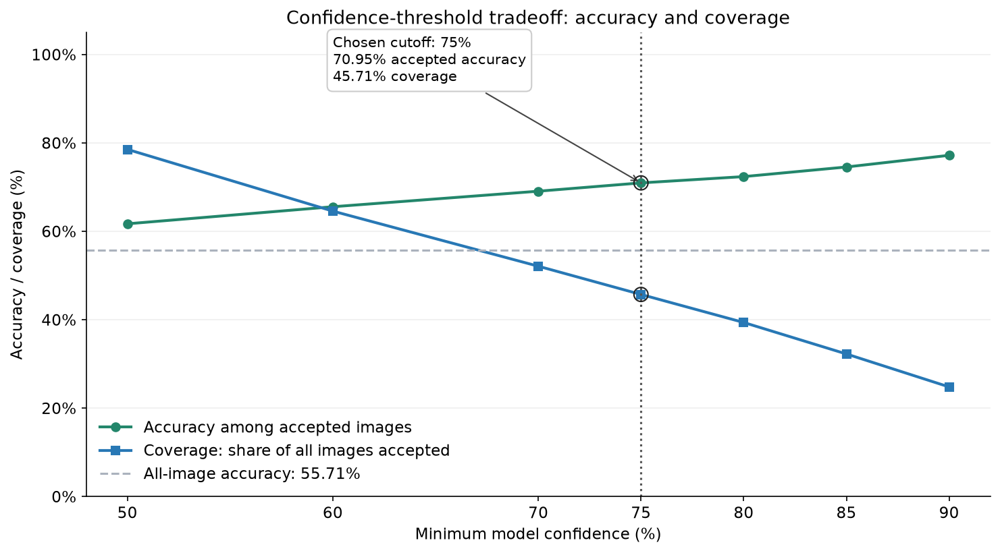
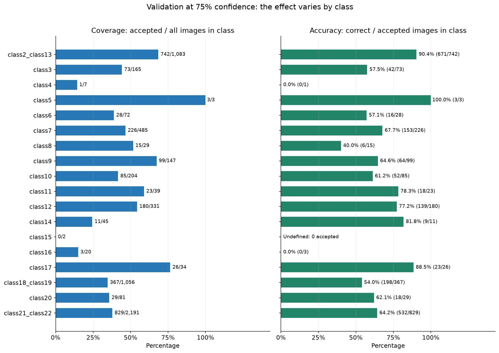
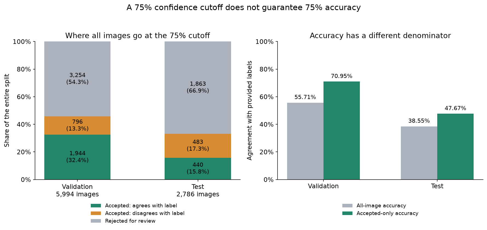

# Notebook 06 summary: confidence filtering and the 75% cutoff

We asked whether the trained classifier could give more accurate predictions on a subset
of images by flagging low-confidence cases for review. The **75% cutoff was selected as an
operating choice after the validation comparisons** and held fixed for the main test result.
It was not a new training step, and it does not mean the model achieves 75% accuracy.

## What we evaluated

We loaded the saved **ConvNeXt-Tiny, 18-class checkpoint**
(`FULL_MERGED_18_classes_convnext_tiny_adamw_trial21_epoch11.pth`) and verified its class order.
This analysis uses the **merged 18-class dataset**, rather than the original 22-class dataset.
Images were loaded as RGB, cropped by 90 pixels at the bottom, resized to 236 pixels on the
short side, center-cropped to 224 × 224, and normalized using the checkpoint's ImageNet preset.
There was no new training or random augmentation.

We predicted all **5,994 validation images** once, recording the predicted class, maximum
softmax score, provided folder label, agreement with that label, and image path. Different
thresholds then reused those same predictions.

An image is accepted when its maximum softmax score is **greater than or equal to the cutoff**.
Raising the cutoff changes which predictions are accepted; it does not change their class labels.

- **Coverage:** accepted images divided by all images in the split.
- **Accepted accuracy:** correct accepted predictions divided by accepted images only.
- **Rejected:** flagged for review; excluded from accepted accuracy, but still counted when reporting coverage.

## How the validation results support the 75% choice

We compared confidence cutoffs from 50% to 90%. Validation accuracy among accepted images rose
as the cutoff increased, while the number of accepted images fell:

| Confidence cutoff | Images accepted | Coverage | Accuracy among accepted images |
| :--- | ---: | ---: | ---: |
| No rejection | 5,994 | 100.00% | 55.71% |
| 50% | 4,707 | 78.53% | 61.70% |
| 60% | 3,870 | 64.56% | 65.56% |
| 70% | 3,123 | 52.10% | 69.07% |
| 75% | 2,740 | 45.71% | 70.95% |
| 80% | 2,360 | 39.37% | 72.37% |
| 85% | 1,933 | 32.25% | 74.55% |
| 90% | 1,486 | 24.79% | 77.19% |

At **75% confidence**, we accepted **2,740 of 5,994 images (45.71%)**. Of those,
**1,944 agreed with the provided labels**, giving **70.95% accepted accuracy**; 796 disagreed.
The remaining **3,254 images (54.29%)** were rejected for review. Compared with the 55.71%
all-image accuracy, this is a 15.24 percentage-point increase on a smaller, selected subset.

The neighboring choices illustrate the tradeoff:

- **70% → 75%:** accepted accuracy rose from 69.07% to 70.95%, while 383 fewer images were accepted.
- **75% → 80%:** accepted accuracy rose from 70.95% to 72.37%, while another 380 images were rejected.
- **75% → 90%:** accepted accuracy rose to 77.19%, but coverage fell from 45.71% to 24.79%.

**What is documented, and what is interpretation:** notebook 06 records the comparison and
the selected 75% cutoff, but gives no preset accuracy target, rejection cost, or optimization
rule that uniquely selects 75% over 70% or 80%. It is therefore best described as a **chosen
compromise between accepted accuracy and coverage**, not a mathematically established optimum.
It is the first tested cutoff above 70% validation accuracy, but the notebook does not document
70% accuracy as the original selection requirement.

## We checked whether that tradeoff held across classes

The same cutoff behaved differently across the 18 provided classes. At 75%, for example,
`class2_class13` retained 742/1,083 validation images and achieved 90.43% accepted accuracy,
whereas `class18_class19` retained 367/1,056 and achieved 53.95%. No `class15` image was
accepted, so its accepted accuracy is undefined. `class5` reached 100%, but from only three
accepted images. These examples show why overall accuracy alone is insufficient.

These groups use the **provided true class**, not the predicted class. The plotted accuracy
is therefore not precision grouped by predicted class, nor recall over all images of a class.

## We fixed the cutoffs and evaluated the test split

We then applied the fixed **75% main cutoff** to all **2,786 test images**, using the same model
and preprocessing. We did not search the test results for a better cutoff in this notebook.

| Result | Validation | Test |
| :--- | ---: | ---: |
| Accuracy without rejection | 55.71% | 38.55% |
| Images accepted at 75% confidence | 2,740 / 5,994 | 923 / 2,786 |
| Coverage | 45.71% | 33.13% |
| Correct accepted predictions | 1,944 | 440 |
| Accepted predictions disagreeing with labels | 796 | 483 |
| Accuracy among accepted images | 70.95% | 47.67% |

The cutoff improved accepted-only test accuracy relative to the all-image result, but
**47.67% agreement on the accepted test subset does not establish a reliably accurate classifier**.
The validation-to-test gap remained. Confidence is a model score, not a calibrated guarantee
of correctness. These results alone do not establish why the gap occurred. The notebook also
notes that the test split had appeared in earlier project evaluation; it is not documented
as a never-before-inspected holdout.

## We used 90% confidence for a separate disagreement review

We listed confident predictions that disagreed with the provided folder labels and grouped
recurring **provided-label → predicted-label** pairs. Pair frequencies were divided by **all
images with that provided label**, including rejected images, to account for class size.

At 90%, there were **339 validation disagreements**. No directed validation pair contained
the required 70 or more disagreements at that cutoff. On test, 90% accepted **380 images
(13.64% coverage)**, with **178 agreements and 202 disagreements**: **46.84% accepted accuracy**.
Thus, raising the test cutoff from 75% to 90% did not improve observed accepted accuracy.

The 90% setting was used to prioritize review, not to replace the 75% main result.
Confident disagreements can reflect model mistakes, label issues, or ambiguous class boundaries;
they are **review candidates, not confirmed labeling errors**. The notebook exported the full
prediction tables, threshold results, per-class results, review lists, and run settings so the
analysis can be revisited without repeating inference.

**Conclusion:** 75% was the selected validation-based confidence filter. It traded lower
coverage for higher accepted accuracy, but it neither guaranteed 75% accuracy nor resolved
the weak test performance.

## Sources within the project

- [Notebook 06](../06_Threshold.ipynb), especially sections 5–7, 9–10, and 11.
- [Validation threshold results](../results/06_Threshold/validation/validation_threshold_results.csv).
- [Validation per-class results](../results/06_Threshold/validation/validation_per_class_threshold_results.csv).
- [Test threshold results](../results/06_Threshold/test/test_threshold_results.csv).
- [Validation review settings](../results/06_Threshold/validation/disagreement_analysis_settings.json).

The figures above were generated from the saved notebook exports; image-level predictions
were checked against the threshold counts. No model inference or threshold selection was rerun.
