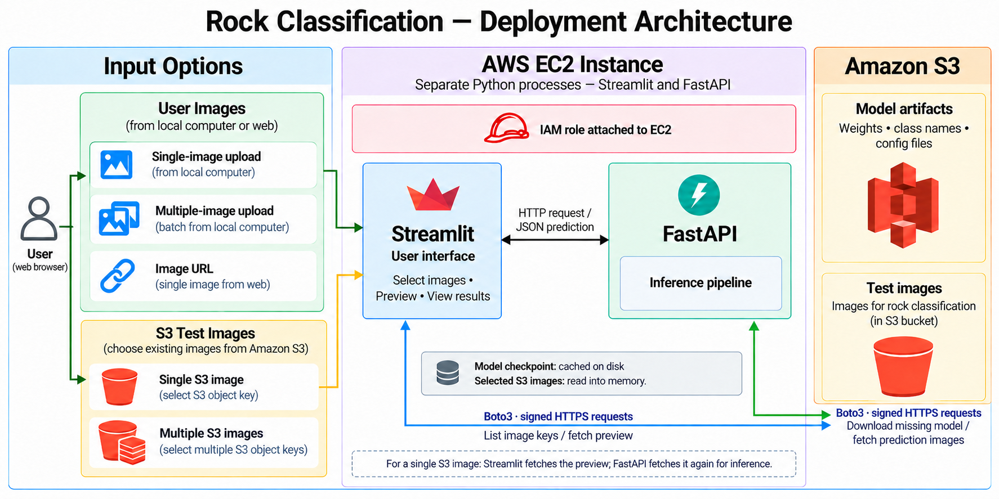

# Deployment
## Deployment Objective
After completing model development and evaluation, the next objective was to make the rock classifier accessible as an interactive application rather than leaving it as a notebook-based experiment.
The deployment system was designed to allow a user to provide petrographic images, run them through the trained ConvNeXt-Tiny classifier, and return the predicted rock class together with the model confidence. The confidence-threshold logic developed during model evaluation was also incorporated so that predictions below the selected 75% threshold could be flagged for review rather than automatically accepted.

## Deployment Architecture

   
  <i>Figure 1: Model Deployment Architecture</i>

### Input Options
The application provides five ways to supply images for classification: single-image upload, multiple-image upload, image URL, single S3 image, and multiple S3 images. Users interact with these options through the Streamlit interface in their browser.

For local uploads, Streamlit sends the uploaded image files to FastAPI. For an image URL, it sends the URL so FastAPI can retrieve the image. For S3 inputs, Streamlit lists available images under the configured test-image prefix and allows the user to select one or several images. In single-image S3 mode, Streamlit also retrieves the selected image for a preview.

When an S3 prediction is requested, Streamlit sends the bucket name and selected object key or keys to FastAPI. FastAPI then retrieves the corresponding images directly from S3. The interface presents the returned class predictions, confidence scores, and acceptance status.

### AWS EC2 Instance
The EC2 instance hosts Streamlit and FastAPI as separate Python processes. Streamlit manages user interaction and result presentation, while FastAPI runs the inference pipeline. The two services communicate through HTTP requests and JSON responses.

An IAM role attached to EC2 provides the AWS permissions required to list and read S3 objects. Boto3, used by both application processes, automatically obtains temporary role credentials through the EC2 instance metadata service and uses them to sign AWS requests. This allows the application to access S3 without embedding access keys in its source code.

At startup, FastAPI checks whether the trained model checkpoint exists on the instance’s disk. If it is missing, the application downloads the model artifacts from S3. The checkpoint is then loaded into memory and reused for predictions. Restarting FastAPI reloads the saved checkpoint from disk; it does not trigger another download while that file remains available. The application does not automatically check whether a newer checkpoint exists in S3.

Selected S3 images are retrieved into application memory for preview or inference rather than saved permanently to disk. FastAPI preprocesses each image, runs the trained classifier, and returns the predicted class, confidence score, top-three predictions, acceptance flag, and prediction time.

### Amazon S3
Amazon S3 provides persistent storage for the trained model artifacts and test images. The model prefix contains the saved model weights and supporting files, including class names and model configuration. The test-image prefix contains the images available through the application’s S3 input options.

Streamlit and FastAPI access S3 independently through Boto3. Streamlit lists image keys and retrieves single-image previews. FastAPI downloads model artifacts when the local checkpoint is missing and retrieves selected images for inference. These operations use signed HTTPS requests authorized by the EC2 instance’s IAM role.

For a single S3 image, the image is retrieved separately by each service: Streamlit fetches it for display, and FastAPI fetches it again when prediction is requested. Multiple-image prediction sends selected object keys to FastAPI, which retrieves and processes the corresponding images.

S3 supplies the stored objects, while preprocessing and model inference take place on EC2. The application’s model-loading and image-prediction paths read from S3; they do not upload prediction results back to the bucket.

## Preparing the Model for Inference
The deployment used the trained ConvNeXt-Tiny checkpoint for the merged 18-class classification problem. The model architecture was reconstructed with an 18-output linear classification layer, and the saved parameters were loaded using load_state_dict().

The checkpoint was loaded onto the CPU with map_location="cpu" and weights_only=True. Calling model.eval() configured the network for evaluation, while torch.inference_mode() disabled gradient tracking during prediction.

Image preprocessing preserved the evaluation pipeline. Each image was converted to RGB, cropped to remove the bottom 90 pixels containing annotations or ruler information, and processed using the ConvNeXt ImageNet transformation preset. A batch dimension was then added before the tensor entered the model. It should be noted here that is the user upload a image that needs a different pre-processing(for instance, there are annotation on the side or the left of the image that needs to be removed), the prediction result might erronous. 

The ordered labels in class_names.json mapped output indices to geological class names. Preserving this order was essential because the model produced numerical class scores rather than text labels.

## Application Security

The deployment exposed **Streamlit as the public user-facing interface**, while FastAPI was restricted to the EC2 instance’s **loopback interface (`127.0.0.1`)**. Streamlit communicated with the FastAPI prediction service internally over HTTP and returned prediction results to the user’s browser. This reduced direct external access to the backend and kept model inference on the server.

Model artifacts were stored in **Amazon S3** and downloaded to the EC2 instance for inference rather than being delivered to users. Access to the model artifacts and S3 test images was controlled through an **IAM role attached to the EC2 instance**. Boto3 obtained temporary credentials automatically from the EC2 instance metadata service, avoiding the need to store AWS access keys in the application source code.

Network access was controlled separately through the EC2 security configuration, allowing the public interface to be exposed while keeping backend services and model assets restricted.

## Confidence-Based Prediction Logic
The application used a confidence threshold of 0.75. A prediction was marked as accepted when its highest softmax score was greater than or equal to this value.

Predictions below the threshold still returned their class labels and scores, but the interface marked them as low confidence. This preserved the model output while identifying cases that warranted closer inspection.

The threshold followed the project’s earlier confidence analysis, where increasing the cutoff improved accuracy among accepted validation predictions while reducing coverage. The 75% cutoff represented a selected operating compromise between those outcomes.
The confidence score remained a model-assigned softmax score; it did not establish that an individual prediction had a calibrated 75% probability of being correct.

## Deployment Challenges

The table below outlines the primary technical hurdles encountered during the deployment pipeline and the architectural solutions implemented to address them.

| Challenge | Solution |
| :--- | :--- |
| **Model file too large for application repository** | Offloaded model storage to **Amazon S3** to keep the primary code repository lightweight. |
| **EC2 could not access S3** | Attached an **IAM role** with appropriate S3 read permissions directly to the EC2 instance. |
| **Streamlit accessible locally but not externally** | Reconfigured the Streamlit server address (`0.0.0.0`) and updated **EC2 Security Group** inbound rules for external web traffic. |
| **Different Python environments** | Established a controlled deployment environment using dedicated virtual environments and an explicit `requirements.txt`. |
| **Model architecture must match saved weights** | Reconstructed the exact **ConvNeXt architecture** definition in code prior to loading state dictionary weights. |
| **UI and inference tightly coupled** | Decoupled the architecture by separating core inference into a **FastAPI** backend and user presentation into a **Streamlit** frontend. |

## Sample of Deployment Pictures

   
  <i>Figure 2: Multiple Images from s3</i>

   
  <i>Figure 3: Single Image from s3</i>

